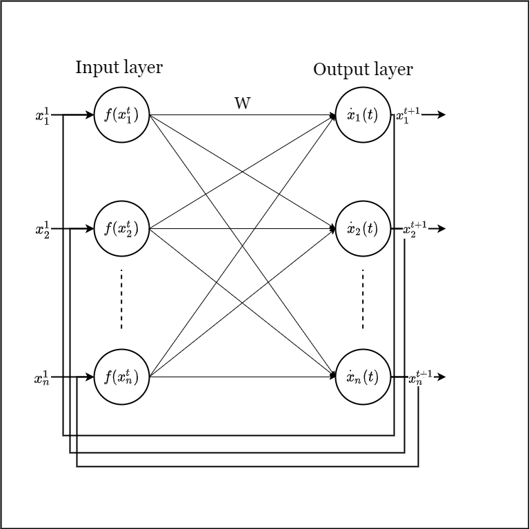

# HopfieldPatternMatching
This project is an application of the Learning associate Hopfield network for chart pattern matching.

[PDF]: https://www.mdpi.com/2076-3417/11/9/3876

## Abstract

Chart patterns are significant for financial market behavior analysis. Lots of approaches have been proposed to detect specific patterns in financial time series data, most of them can be categorized as distance-based or training-based. In this paper, we applied a trainable continuous Hopfield Neural Network for financial time series pattern matching. The Perceptually Important Points (PIP) segmentation method is used as the data preprocessing procedure to reduce the fluctuation. We conducted a synthetic data experiment on both high-level noisy data and low-level noisy data. The result shows that our proposed method outperforms the Template Based (TB) and Euclidean Distance (ED) and has an advantage over Dynamic Time Warping (DTW) in terms of the processing time. That indicates the Hopfield network has a potential advantage over other distance-based matching methods.

## Diagram

